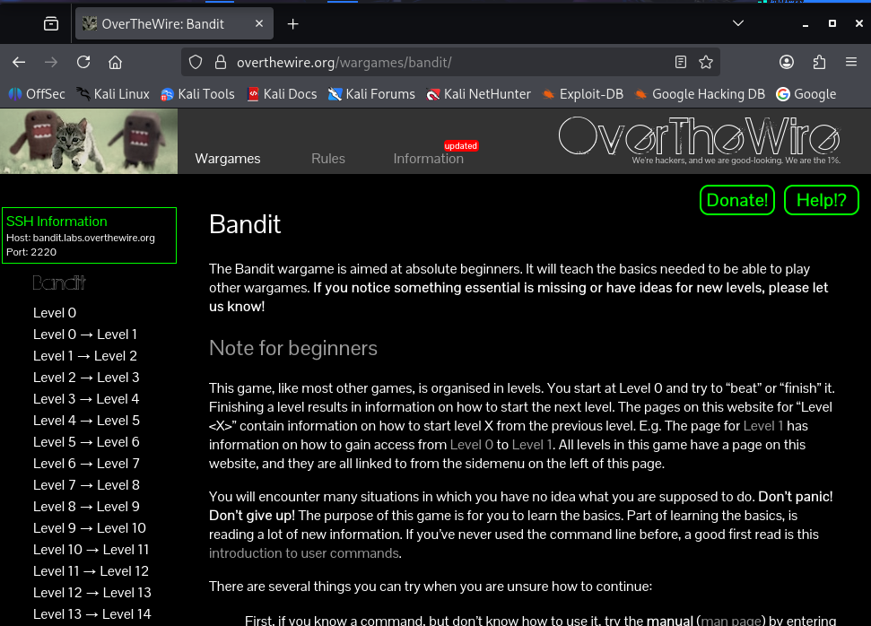

# bandit-harjoitus-teema
pieni harjoittelu, perus linux komentoja ja järjestelmän perusominaisuutta. Tämä "overthewire" sivuston alta löytyy muita harjoituspelejä, että taso alkaa 0 (nollasta) liikeelle ja siitä menee vaikeammaksi. 

- **Tarkoitus:** Bandit on tarkoitettu aloittelijoille ja se keskittyy komentorivikäytön, tiedostojärjestelmän ja perus-hakkeroinnin opetteluun.
- **Teema:** Bandit on parhaiten tunnettu sen simppelistä ja suoraviivaisesta lähestymistavastaan. Haasteet käsittelevät pääasiassa oikeuksia, tiedostoja, hakemistoja ja salasanan murtamista.

## harjoitus linkki:
[https://overthewire.org/wargames/natas/](https://overthewire.org/wargames/bandit/)  
https://overthewire.org/wargames/ (sama linkki, mutta etusivu)

## Miten se toimii ja mitä tästä oppii?

- Kirjaudut etäpalvelimelle (SSH-yhteydellä)
- Saat tehtävän jokaisella tasolla
- Ratkaiset tehtävän Linux-komennoilla
- Saat salasanan seuraavalle tasolle

Esimerkki yhteydestä: `$ssh bandit0@bandit.labs.overthewire.org -p 2220`

- Peruskomennot (ls, cd, cat)
- Tiedostojen käsittely
- Piilotiedostot
- Käyttöoikeudet (permissions)
- Prosessit
- Verkkoperusteet
- Salaus ja dekoodaus

